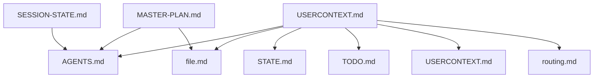

# Dependency Graph
**Auto-Generated:** 2025-10-18 05:34:18 UTC
**Source:** @ references in .md files + import statements in .ts files
**Script:** `.genie/scripts/build-dependency-graph.py`

---

## Overview

**Total Nodes:** 136 files
**Total Edges:** 332 dependencies
**Circular Dependencies:** 0 detected

---

## Visual Map



---

## Hub Nodes (Most Referenced)

1. **.genie/AGENTS.md** - Referenced 20 times
2. **cli/src/session-store** - Referenced 12 times
3. **.genie/genie/product/mission.md** - Referenced 11 times
4. **.genie/genie/standards/best-practices.md** - Referenced 10 times
5. **.genie/genie/USERCONTEXT.md** - Referenced 9 times
6. **cli/src/lib/view-helpers** - Referenced 9 times
7. **.genie/genie/agents/prompt.md** - Referenced 7 times
8. **.genie/genie/agents/code/agents/git/git.md** - Referenced 7 times
9. **.genie/genie/product/roadmap.md** - Referenced 7 times
10. **cli/src/views/common** - Referenced 7 times

---

## Usage

This file is auto-generated from codebase dependencies. To update:

```bash
python .genie/scripts/build-dependency-graph.py
```

To run with dry-run:

```bash
python .genie/scripts/build-dependency-graph.py --dry-run
```

To automate via GitHub Actions (future):
- Add workflow trigger: monthly or on major changes
- Run script and commit changes
- Track architectural evolution

---

## Legend

**@ References:** Markdown files referencing other markdown files via `@path/to/file.md`
**Import Statements:** TypeScript files importing other TypeScript modules

**Hub Nodes:** Files referenced most frequently (architectural keypoints)
**Circular Dependencies:** Files that reference each other (may indicate coupling)

---

## Interpretation

**High hub node count:** Core architectural files (AGENTS.md, CLAUDE.md, etc.)
**Many edges from file:** File loads lots of context (heavy dependencies)
**Circular dependencies:** Review for potential refactoring opportunities

This graph helps understand:
- Which files are central to the architecture
- How knowledge flows through the system
- Where coupling might be reduced
- Evolution of architectural patterns over time
