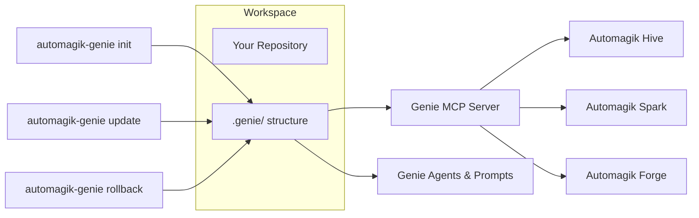

<p align="center">
  
</p>
<h2 align="center">The Universal AI Development Companion</h2>

<p align="center">
  <strong>🎯 Initialise, update, and orchestrate AI agents across any codebase</strong><br>
  Ship the Genie toolkit in minutes, keep it patched with smart updates, and command projects through MCP-integrated agents
</p>

<p align="center">
  <a href="https://github.com/namastexlabs/automagik-genie/actions/workflows/validate.yml"></a>
  <a href="https://github.com/namastexlabs/automagik-genie/blob/main/LICENSE"></a>
  <a href="https://discord.gg/xcW8c7fF3R"></a>
</p>

<p align="center">
  <a href="#-key-features">Features</a> •
  <a href="#-quick-start">Quick Start</a> •
  <a href="#-mcp-integration">MCP Integration</a> •
  <a href="#-roadmap">Roadmap</a> •
  <a href="#-development">Development</a> •
  <a href="#-contributing">Contributing</a>
</p>

---

**Version:** !`node -p "require('./package.json').version"` | **Status:** !`git status --porcelain | wc -l` uncommitted files

**Quick Links:** [@AGENTS.md](./AGENTS.md) • [@CLAUDE.md](./CLAUDE.md) • [.genie/README.md](./.genie/README.md)

---

## 🚀 What is Automagik Genie?

**Automagik Genie** is your persistent conversational development partner. Just talk naturally—Genie orchestrates agents, maintains context through neuron sessions, and guides you through Plan → Wish → Forge → Review without exposing commands or complexity.

It ships a ready-to-run `.genie/` workspace, keeps it in sync with upstream templates, and exposes a battle-tested CLI + MCP server with natural language routing.

### 🎭 Why Traditional Bootstrapping Fails

- **Manual setup drift** – each repo receives a slightly different `.claude` folder
- **No update path** – templates go stale, breaking downstream agents
- **Scattered backups** – figuring out what changed between runs is painful
- **Agent isolation** – MCP tooling cannot rely on a consistent project schema

### ✅ The Genie Approach

- **One-command initialise** – `npx automagik-genie init` migrates legacy `.claude`, writes provider preferences, and snapshots the workspace
- **Smart updates** – `npx automagik-genie update` diff-checks templates, creates recoverable backups, and applies only what changed
- **Automatic rollbacks** – `npx automagik-genie rollback` restores any prior snapshot in seconds
- **MCP-native** – the CLI and the MCP server share the same state, so agents always see the latest project context

---

## 🌟 Key Features

- **🧞 CLI bootstrap commands** – `init`, `update`, `rollback`, `statusline`, and compatibility shims for `status`/`cleanup`
- **📦 Template migration** – automatic conversion of historical `.claude` setups into the unified `.genie` layout
- **🔐 Provider memory** – stores Codex/Claude preference in `.genie/state/provider.json` and respects env overrides
- **💾 Version tracking** – `.genie/state/version.json` records install vs. update timestamps for diagnostics
- **🛟 Snapshot backups** – every command saves `.genie/backups/<timestamp>` (and `.claude` if present) before changing files
- **🤖 MCP server** – expose Genie agents to Claude Code, Cursor, Gemini CLI, Roo Code, and any generic MCP client
- **📋 Ink-powered UI** – rich terminal output for help, diffs, warnings, and summary panels

---

## 🧭 How Genie Fits in the Automagik Suite



Genie is the canonical source of prompts, agents, and project metadata. Other Automagik products (Hive, Spark, Forge, Omni) rely on Genie to keep repository context predictable.

---

## 🧠 Agent Neural Tree

Genie's architecture uses **universal neurons** (shared across all templates) and **template-specific neurons** (code/create). This enables scalability without duplication.

<!-- AGENT_TREE_START -->

<!-- AGENT_TREE_END -->

```mermaid
graph TB
    %% Genie Agent Tree

    %% Code Collective
    CODE[Code Collective]:::orchestrator
    code_analyze[analyze]:::code_agent
    CODE --> code_analyze
    code_audit[audit]:::code_agent
    CODE --> code_audit
    code_challenge[challenge]:::code_agent
    CODE --> code_challenge
    code_commit[commit]:::code_agent
    CODE --> code_commit
    code_consensus[consensus]:::code_agent
    CODE --> code_consensus
    code_debate[debate]:::code_agent
    CODE --> code_debate
    more_code[...24 more]:::more
    CODE --> more_code

    %% Git Workflows
    code_git --> git_issue[issue]:::workflow
    code_git --> git_pr[pr]:::workflow
    code_git --> git_report[report]:::workflow

    %% Code Workflows
    workflow_forge[forge]:::workflow
    CODE --> workflow_forge
    workflow_session-state-updater[session-state-updater]:::workflow
    CODE --> workflow_session-state-updater
    workflow_session-state-updater-example[session-state-updater-example]:::workflow
    CODE --> workflow_session-state-updater-example
    workflow_wish[wish]:::workflow
    CODE --> workflow_wish

    %% Create Collective
    CREATE[Create Collective]:::orchestrator
    create_wish[wish]:::create_agent
    CREATE --> create_wish

    %% Styling
    classDef orchestrator fill:#fff3e0,stroke:#f57c00,stroke-width:3px
    classDef code_agent fill:#e8f5e9,stroke:#388e3c,stroke-width:2px
    classDef create_agent fill:#fce4ec,stroke:#c2185b,stroke-width:2px
    classDef workflow fill:#fff9c4,stroke:#fbc02d,stroke-width:1px
    classDef more fill:#f5f5f5,stroke:#9e9e9e,stroke-width:1px,stroke-dasharray: 5 5
```

**See [.genie/README.md](./.genie/README.md) for detailed agent documentation**

---

## 📦 Quick Start

### Prerequisites

- **Node.js 18+** (tested with pnpm 10+)
- **Git** for snapshot creation
- (Optional) **pnpm** if you plan to run tests locally: `corepack enable`

### One-Time Installation

```bash
# Initialise Genie in your repository
npx automagik-genie init --provider codex

# Show planned updates without applying them
npx automagik-genie update --dry-run

# Apply template changes and create a backup
npx automagik-genie update

# Restore the most recent backup if needed
npx automagik-genie rollback --latest
```

### CLI Help at a Glance

```bash
npx automagik-genie            # Shows the command palette
npx automagik-genie init --help
npx automagik-genie update --help
npx automagik-genie rollback --help
```

After running `init` you'll have:

- `.genie/agents/` – prompt and core agents shipped with Genie
- `.genie/custom/` – project-specific overrides consumed by the core agents (entrypoints stay immutable)
- `.genie/product/` – mission, roadmap, environment docs
- `.genie/state/` – provider, version, provider-status state
- `.genie/backups/<timestamp>/` – snapshots of previous states

---

## 📡 MCP Integration

Genie ships with a FastMCP server so any MCP-compatible coding agent can orchestrate Genie workflows.

### Typical Workflow

1. **Setup:** Initialise Genie in your repo (`npx automagik-genie init`)
2. **Connect:** Configure your tool (Claude Code, Cursor, etc.) with the MCP command
3. **Just talk:** "I want to build an auth system"
4. **Genie guides you:** Through Plan → Wish → Forge → Review naturally
5. **Neuron sessions:** Genie maintains persistent conversations with specialist agents (genie, implementor, tests) that remember context and iterate over time

**No slash commands. No agent names. Just conversation.**

### Available MCP Tools

| Tool | Description | Example Usage |
|------|-------------|---------------|
| `mcp__genie__run` | Start a new neuron session | Genie uses this to start persistent conversations |
| `mcp__genie__resume` | Continue a neuron session | Genie resumes to build context over time |
| `mcp__genie__list_agents` | List available agents | "Show all agents" |
| `mcp__genie__list_sessions` | Inspect active/archived sessions | "Which sessions ran today?" |
| `mcp__genie__view` | Fetch session transcript | View conversation history with neurons |
| `mcp__genie__stop` | Halt a running session | Stop long-running neuron work |

**Neuron Sessions:** Genie creates persistent conversations with specialist agents (genie, implementor, tests) that remember context across iterations. This enables Socratic dialogues, iterative refinement, and longer collaboration without context resets.

### Claude Code Configuration

```json
{
  "mcpServers": {
    "automagik-genie": {
      "command": "npx",
      "args": ["automagik-genie", "mcp", "-t", "stdio"]
    }
  }
}
```

Other MCP clients (Cursor, Roo, Gemini CLI, Cline) follow the same pattern—just change the command/args if you need HTTP or SSE transports.

---

## 🔄 Self-Updating Ecosystem

Genie includes a comprehensive **git hook automation system** that maintains documentation, validates changes, and enforces quality standards automatically.

### What Gets Automated

**Pre-Commit (Validation + Updates):**
- ✅ **User file protection** - Blocks `.genie/TODO.md` and `.genie/USERCONTEXT.md` from commits
- ✅ **Cross-reference validation** - Catches broken `@file.md` references before commit
- ✅ **Token efficiency gate** - Blocks commits if token count increases >5% without justification
- ✅ **Neural graph auto-generation** - Updates AGENTS.md with token counts and dependency tree
- ✅ **Agent registry auto-generation** - Scans folders and updates agent/neuron/skill lists
- ✅ **Universal headers injection** - Adds `Last Updated` timestamps to all .md files
- ✅ **Forge task linking** - Auto-links Forge task metadata to wish documents

**Pre-Push (Quality Enforcement):**
- ✅ **Test runner** - Blocks push if `pnpm test` fails
- ✅ **CHANGELOG auto-generation** - Groups commits by type (feat, fix, refactor) since last tag

**Post-Merge (State Updates):**
- ✅ **STATE.md auto-update** - Updates version and commit hash after merge

**On-Demand (Evidence & Analytics):**
- ✅ **QA sync from GitHub issues** - Converts bugs into test scenarios (53 scenarios generated)
- ✅ **Dependency graph generation** - Visual Mermaid diagram of ecosystem structure (136 files, 332 dependencies)

### Token Efficiency Workflow

The token efficiency gate ensures AGENTS.md stays lean:

```bash
# Commit triggers validation
git commit -m "feat: add comprehensive audit neuron"

# ❌ Token count increased by 8.2% (threshold: 5%)
#    Current: 95,234 | Baseline: 88,000 | Change: +7,234
#
# If this increase is justified:
#    git config commit.token-override "Added audit neuron with 18 validation rules"

# Justify and retry
git config commit.token-override "Added audit neuron (18 validation rules)"
git commit -m "feat: add comprehensive audit neuron"

# ✅ Token efficiency validated (justified increase)
# ✅ Neural graph updated in AGENTS.md (Total: 95,234 tokens)
# ✅ Agent registry updated (Neurons: 18 total)
# ✅ All pre-commit validations passed
```

### Auto-Generated Sections

Two sections in **AGENTS.md** are automatically maintained:

**Agent Registry:**
```markdown
## Agent Registry (Auto-Generated)
**Last Updated:** 2025-10-18 16:45:59 UTC

**Universal Neurons:** 16 total
- analyze, audit, debate, design-review, forge, learn, plan, prompt, qa, review, ...

**Code Neurons:** 15 total
- commit, debug, git, implementor, polish, refactor, release, tests, ...

**Code Skills:** 32 total
- delegation-discipline, evidence-based-thinking, forge-integration, ...
```

**Neural Graph:**
```markdown
## Neural Graph Architecture (Auto-Generated)
**Last Updated:** 2025-10-18 16:45:24 UTC
**Total Tokens:** 23,622 (baseline for efficiency validation)

**Distribution:**
- Skills: 19,381 tokens (82.0%)
- Other: 3,276 tokens (13.9%)
- Core Framework: 965 tokens (4.1%)

**Hierarchy:**
- **AGENTS.md** (965 tokens, +22,657 from 36 refs)
  - **.genie/agents/code/skills/know-yourself.md** (1,359 tokens)
  - **.genie/agents/code/skills/evidence-based-thinking.md** (750 tokens)
  ...
```

### Hook Installation

Git hooks are installed automatically when you clone the repository. They're located in `.git/hooks/`:
- `pre-commit` - Validation and auto-updates
- `pre-push` - Tests and CHANGELOG
- `post-merge` - STATE.md updates

**No manual setup required** - hooks work out of the box.

### Manual Script Usage

You can run any automation script manually:

```bash
# Validate cross-references
node .genie/scripts/validate-cross-references.js

# Update neural graph
node .genie/scripts/update-neural-graph.js

# Update agent registry
node .genie/scripts/update-agent-registry.js

# Sync QA scenarios from GitHub issues
node .genie/scripts/sync-qa-from-issues.js

# Generate dependency graph
node .genie/scripts/build-dependency-graph.js

# All scripts support --dry-run and --help
node .genie/scripts/validate-token-count.js --help
```

### Override Mechanisms

**Token efficiency override** (one-time use):
```bash
git config commit.token-override "Reason for increase"
# Override automatically cleared after successful commit
```

**Skip pre-commit hooks** (not recommended):
```bash
git commit --no-verify
```

---

## 🧪 Development

```bash
pnpm install             # Install dependencies
pnpm run build:genie      # Compile the TypeScript CLI
pnpm run test:genie       # Run CLI + smoke tests
```

All CLI code lives under `.genie/cli/src/`. Rebuild (`pnpm run build:genie`) before committing so `.genie/cli/dist/**/*` stays in sync for npm consumers.

---

## 🗺️ Roadmap

### Completed ✅
- Reinstated bootstrap commands (`init`, `update`, `rollback`)
- Automatic migration from legacy `.claude` directories
- Provider/Version state tracking and backup snapshots
- MCP server parity with the agent CLI

### Next Up 🚀
- Rich diff previews during `update`
- Extended provider health checks and auto-detection
- JSON output mode for CI integrations
- Replacement flows for deprecated `status` / `cleanup`

---

## 🤝 Contributing

We love contributions! Before you start:

1. Read the [CONTRIBUTING guidelines](CONTRIBUTING.md) for philosophy and standards
2. Open an issue to align on intent
3. Follow Conventional Commits (`feat: ...`, `fix: ...`, etc.) and co-author with 🧞
4. Run `pnpm run test:genie` and rebuild the dist bundle before submitting

---

## 📄 License

Automagik Genie is released under the MIT License. See [LICENSE](LICENSE) for details.

---

**Automagik Genie** – the faster, safer way to keep AI agents in sync with your repositories.

<a href="https://deepwiki.com/namastexlabs/automagik-genie"></a>
