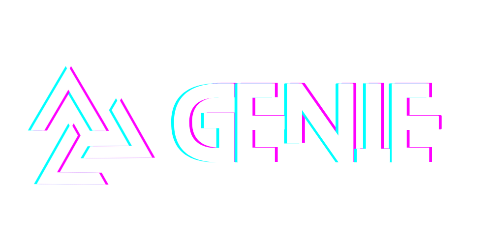
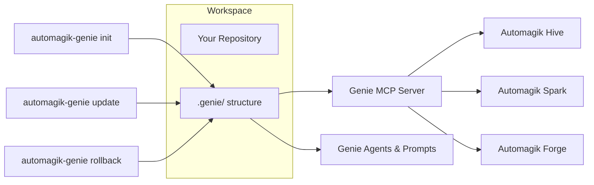

<p align="center">
  
</p>
<h2 align="center">The Universal AI Development Companion</h2>

<p align="center">
  <strong>🎯 Initialise, update, and orchestrate AI agents across any codebase</strong><br>
  Ship the Genie toolkit in minutes, keep it patched with smart updates, and command projects through MCP-integrated agents
</p>

<p align="center">
  <a href="https://github.com/namastexlabs/automagik-genie/actions/workflows/validate.yml"></a>
  <a href="https://github.com/namastexlabs/automagik-genie/blob/main/LICENSE"></a>
  <a href="https://discord.gg/xcW8c7fF3R"></a>
  <a href="https://github.com/orgs/namastexlabs/projects/9/views/1?filterQuery=project%3Agenie"></a>
</p>

<p align="center">
  <a href="#-start-here">Start Here</a> •
  <a href="#-key-features">Features</a> •
  <a href="#-quick-start">Quick Start</a> •
  <a href="#-mcp-integration">MCP Integration</a> •
  <a href="https://github.com/orgs/namastexlabs/projects/9/views/1?filterQuery=project%3Agenie">Roadmap</a> •
  <a href="#-development">Development</a> •
  <a href="#-contributing">Contributing</a>
</p>
## 🚀 What is Automagik Genie?

**Automagik Genie** is your persistent AI development orchestrator. It's the command center that turns conversations with AI into structured, trackable work through the **Wish → Forge → Review** workflow.

**The Power:** Genie maintains persistent agent sessions that remember context across iterations, orchestrates task execution via Automagik Forge, and integrates with any AI coding tool through MCP. No slash commands, no complexity—just natural conversation that gets things done.

It ships a ready-to-run `.genie/` workspace with 30+ specialized agents, integrates seamlessly with Automagik Forge for isolated task execution, and exposes a battle-tested CLI + MCP server for any AI coding platform.

### 🎭 Why Conversations Get Lost

- **Context resets** – every AI conversation starts from scratch, losing project knowledge
- **No task tracking** – brilliant ideas vanish in chat history, work gets duplicated
- **No structure** – AI gives you code, you ship it, it breaks in 2 weeks (the vibe coding curse)
- **Tool switching** – jumping between Claude, Cursor, terminal, GitHub loses momentum

### ✅ The Genie Solution

- **Persistent Sessions** – Agent conversations remember context across iterations (like talking to the same expert over days)
- **Structured Workflows** – Wish → Forge → Review keeps work organized and reviewable
- **Forge Integration** – Every task executes in isolated Git worktrees, safe experimentation before merge
- **Universal MCP** – Works with Claude Code, Cursor, Gemini CLI, or any MCP-compatible tool
- **30+ Specialized Agents** – From architecture planning to PR reviews, each agent is an expert in their domain

---

## 🌟 Key Features

- **🤖 Persistent Agent Sessions** – Conversations that remember context across hours/days (resume anytime with full history)
- **🔄 Wish → Forge → Review Workflow** – Structured path from idea to shipped code with safety gates
- **🏗️ Forge Integration** – Automatic task execution in isolated Git worktrees (experiment safely before merge)
- **📡 Universal MCP Server** – Works with Claude Code, Cursor, Gemini CLI, Roo Code, and any MCP-compatible AI tool
- **🧠 30+ Specialized Agents** – Architecture, implementation, testing, debugging, PR review, and more
- **📝 Session Transcripts** – Full conversation history for every agent session (audit trail + learning)
- **🎯 Natural Language Routing** – No slash commands needed, just talk naturally
- **⚡ Instant Startup** – Production-grade process management, Forge ready in 10-12s

---

## 🧭 How Genie Fits in the Automagik Suite



Genie is the canonical source of prompts, agents, and project metadata. Other Automagik products (Hive, Spark, Forge, Omni) rely on Genie to keep repository context predictable.

---

## 🧠 Agent Agent Tree

Genie's architecture uses **universal agents** (shared across all templates) and **template-specific agents** (code/create). This enables scalability without duplication.

```mermaid
graph TB
    %% Genie Agent Tree

    %% Code Collective
    CODE[Code Collective]:::orchestrator
    code_analyze[analyze]:::code_agent
    CODE --> code_analyze
    code_audit[audit]:::code_agent
    CODE --> code_audit
    code_challenge[challenge]:::code_agent
    CODE --> code_challenge
    code_commit[commit]:::code_agent
    CODE --> code_commit
    code_consensus[consensus]:::code_agent
    CODE --> code_consensus
    code_debate[debate]:::code_agent
    CODE --> code_debate
    more_code[...24 more]:::more
    CODE --> more_code

    %% Git Workflows
    code_git --> git_issue[issue]:::workflow
    code_git --> git_pr[pr]:::workflow
    code_git --> git_report[report]:::workflow

    %% Code Workflows
    workflow_forge[forge]:::workflow
    CODE --> workflow_forge
    workflow_session-state-updater[session-state-updater]:::workflow
    CODE --> workflow_session-state-updater
    workflow_session-state-updater-example[session-state-updater-example]:::workflow
    CODE --> workflow_session-state-updater-example
    workflow_wish[wish]:::workflow
    CODE --> workflow_wish

    %% Create Collective
    CREATE[Create Collective]:::orchestrator
    create_wish[wish]:::create_agent
    CREATE --> create_wish

    %% Styling
    classDef orchestrator fill:#fff3e0,stroke:#f57c00,stroke-width:3px
    classDef code_agent fill:#e8f5e9,stroke:#388e3c,stroke-width:2px
    classDef create_agent fill:#fce4ec,stroke:#c2185b,stroke-width:2px
    classDef workflow fill:#fff9c4,stroke:#fbc02d,stroke-width:1px
    classDef more fill:#f5f5f5,stroke:#9e9e9e,stroke-width:1px,stroke-dasharray: 5 5
```

<!-- AGENT_TREE_START -->

<!-- AGENT_TREE_END -->

**See [.genie/README.md](./.genie/README.md) for detailed agent documentation**

---

## 🎬 Start Here

**New to Genie? Choose your approach:**

### 🚀 Quick Run (No Install)

**Use this if you just want to test Genie without installing anything:**

**Linux / macOS:**
```bash
curl -fsSL https://raw.githubusercontent.com/namastexlabs/automagik-genie/main/run.sh -o /tmp/genie-run.sh && bash /tmp/genie-run.sh
```

**Windows (PowerShell):**
```powershell
$script = irm https://raw.githubusercontent.com/namastexlabs/automagik-genie/main/run.ps1; powershell -Command $script
```

**What this does:**
- ✅ Runs Genie via pnpm dlx (no permanent install)
- ✅ Perfect for quick testing
- ✅ Fast execution with pnpm

---

### 📦 Global Install (Recommended)

**Use this for the best performance and DX:**

**All Platforms:**
```bash
# Automated install (installs Node.js, pnpm, and Genie)
curl -fsSL https://raw.githubusercontent.com/namastexlabs/automagik-genie/main/run.sh -o /tmp/genie.sh && bash /tmp/genie.sh

# Or install manually if you have Node.js already:
pnpm install -g automagik-genie@next
```

**What this does:**
- ✅ Installs Node.js 22 (if needed)
- ✅ Installs pnpm package manager
- ✅ Installs Genie globally
- ✅ Enables `genie` command anywhere
- ✅ Enables version checking and auto-updates

---

**Alternative:** Download and run manually from [INSTALL.md](INSTALL.md) for step-by-step instructions.

---

## 📦 Quick Start

### Prerequisites

- **Node.js 18+** (tested with pnpm 10+)
- **Git** for snapshot creation
- (Optional) **pnpm** if you plan to run tests locally: `corepack enable`

### First Run

```bash
# Navigate to your project
cd your-project

# Start Genie (auto-initializes on first run)
genie

# Or just run the MCP server for AI tool integration
genie mcp
```

### CLI Help at a Glance

**Server Management:**
```bash
genie                  # Start Genie server (Forge + MCP)
genie status          # Show server status and statistics
genie mcp             # Start MCP server in stdio mode (for Claude Desktop)
```

**Agent Orchestration:**
```bash
genie run <agent> <prompt>     # Run an agent with a prompt
genie resume <sessionId> <msg> # Resume an existing agent session
genie list [type]              # List agents, sessions, or workflows
genie view <sessionId>         # View session transcript
genie stop <sessionId>         # Stop a running session
```

**Workspace Management:**
```bash
genie init [template]    # Initialize workspace
genie rollback          # Restore previous backup
```

**Package Management:**
```bash
genie update            # Update Genie npm package (shows changelog from GitHub)
genie update --check    # Check for updates without installing
```

After first run you'll have:

- `.genie/agents/` – 30+ specialized agents (genie, implementor, tests, git, learn, etc.)
- `.genie/code/` – Code-specific workflows and skills
- `.genie/product/` – Mission, roadmap, tech stack documentation
- `.genie/state/` – Session history, Forge connection state
- `.genie/backups/<timestamp>/` – Automatic snapshots before major changes

---

## ⚡ Performance - Blazing Fast Startup

Genie is optimized for **instant startup** with production-grade process management.

### 🚀 Startup Time

| Metric | Time | Details |
|--------|------|---------|
| **Total Startup** | 10-12s | Forge init + MCP ready |
| **Binary Extraction** | 0s | ✨ Pre-extracted (no delay!) |
| **Forge Spawn** | <100ms | Instant process launch |
| **Health Check** | <50ms | Exponential backoff retry |

### 📊 Benchmark Results

Run the performance benchmark yourself:

```bash
# Install latest version
npm install -g automagik-genie@next

# Run benchmark (3 runs with warm-up)
GENIE_SHOW_PERF=true npx automagik-genie

# Or run custom benchmark
node scripts/benchmark-startup.js

# Example output:
# 📊 Run 1/3: 11.2s ✓
# 📊 Run 2/3: 10.8s ✓
# 📊 Run 3/3: 11.0s ✓
#
# Average: 11.0s | Median: 11.0s | Fastest: 10.8s
```

### 🎯 Optimization Details

**1. Zero-Extraction Startup**
- ❌ Before: Delete + extract binary every run (5-10s delay)
- ✅ After: Use pre-extracted binaries (instant!)
- 📦 Trade-off: +69MB package size for **40-50% faster startup**

**2. Production-Grade Process Management**
- ✅ Type-safe `Result<T, E>` error handling
- ✅ Exponential backoff on health checks (100ms → 200ms → 400ms)
- ✅ Process lifecycle tracking (spawn/exit/error handlers)
- ✅ Graceful shutdown with verification (SIGTERM → wait → SIGKILL)
- ✅ No file descriptor leaks

**3. Performance Metrics**
- Enable with: `GENIE_SHOW_PERF=true npx automagik-genie`
- Shows: Port check, health check, Forge spawn, total time
- Helps identify bottlenecks in your environment

### 🔬 Technical Implementation

**Binary Resolution** (version-agnostic):
```typescript
// Automatically detects npm vs pnpm structure
// Finds latest installed version
// No hardcoded paths!
const binary = resolveForgeBinary();
```

**Health Check** (with retry logic):
```typescript
// 3 attempts with exponential backoff
// 100ms → 200ms → 400ms delays
// 3s timeout per attempt
await isForgeRunning(baseUrl, retries: 3);
```

**Process Spawn** (robust error handling):
```typescript
// Detached process (survives parent exit)
// Error handlers for spawn/exit/crash
// Comprehensive logging to .genie/state/forge.log
startForgeInBackground({ baseUrl, logDir });
```

---

## 📡 MCP Integration

Genie ships with a FastMCP server so any MCP-compatible AI tool can orchestrate Genie workflows and maintain persistent agent sessions.

### Typical Workflow

1. **Setup:** Install Genie (`curl -fsSL https://genie.namastex.ai/install | bash`)
2. **Connect:** Add MCP config to your AI tool (Claude Code, Cursor, etc.)
3. **Just talk:** "I want to build an auth system with social login"
4. **Genie orchestrates:**
   - Creates persistent agent session (remembers context)
   - Routes to specialist (genie agent for architecture planning)
   - Generates Wish document (structured requirements)
   - Creates Forge tasks (isolated worktree execution)
   - Manages Review workflow (safe merge process)
5. **Resume anytime:** "Continue the auth system work" → Genie picks up where you left off

**No slash commands. No manual agent selection. Just natural conversation with persistent memory.**

### Available MCP Tools

| Tool | Description | What It Enables |
|------|-------------|-----------------|
| `mcp__genie__run` | Start a new agent session | Launch specialist agents (genie, implementor, tests, git, learn) with persistent context |
| `mcp__genie__resume` | Continue existing session | Pick up conversations hours/days later with full context history |
| `mcp__genie__list_agents` | List available agents | Discover 30+ specialized agents and their capabilities |
| `mcp__genie__list_sessions` | View session history | See active sessions, completed work, and conversation archives |
| `mcp__genie__view` | Read session transcript | Full conversation history for learning and auditing |
| `mcp__genie__stop` | Halt running session | Gracefully stop long-running agent work |

**The Power of Persistent Sessions:**
Unlike traditional AI chats that forget everything, Genie agents maintain context across iterations. Start architecture planning on Monday, continue implementation on Wednesday, debug on Friday—each session remembers the full conversation history. This enables:
- **Iterative refinement** without repeating context
- **Socratic dialogue** where agents learn your preferences
- **Long-running projects** that span days/weeks
- **Audit trails** of every decision made

### Claude Code Configuration

<details>
<summary><b>Click to expand MCP config</b></summary>

```json
{
  "mcpServers": {
    "automagik-genie": {
      "command": "npx",
      "args": ["automagik-genie", "mcp"]
    }
  }
}
```

**After adding config:**
1. Restart Claude Code
2. Verify connection: Look for "automagik-genie" in MCP servers list
3. Start using: Just talk naturally, Genie handles the rest

</details>

<details>
<summary><b>Other MCP Clients (Cursor, Roo, Gemini CLI, Cline)</b></summary>

All MCP clients follow the same pattern:

**Generic config:**
```json
{
  "command": "npx",
  "args": ["automagik-genie", "mcp"]
}
```

Consult your AI tool's MCP documentation for exact configuration format.

</details>

---

## 🔄 Self-Updating Ecosystem

Genie includes a comprehensive **git hook automation system** that maintains documentation, validates changes, and enforces quality standards automatically.

### What Gets Automated

**Pre-Commit (Validation + Updates):**
- ✅ **User file protection** - Blocks `.genie/TODO.md` and `.genie/USERCONTEXT.md` from commits
- ✅ **Cross-reference validation** - Catches broken `@file.md` references before commit
- ✅ **Token efficiency gate** - Blocks commits if token count increases >5% without justification
- ✅ **Agent graph auto-generation** - Updates AGENTS.md with token counts and dependency tree
- ✅ **Agent registry auto-generation** - Scans folders and updates agent/agent/skill lists
- ✅ **Universal headers injection** - Adds `Last Updated` timestamps to all .md files
- ✅ **Forge task linking** - Auto-links Forge task metadata to wish documents

**Pre-Push (Quality Enforcement):**
- ✅ **Test runner** - Blocks push if `pnpm test` fails
- ✅ **CHANGELOG auto-generation** - Groups commits by type (feat, fix, refactor) since last tag

**Post-Merge (State Updates):**
- ✅ **STATE.md auto-update** - Updates version and commit hash after merge

**On-Demand (Evidence & Analytics):**
- ✅ **QA sync from GitHub issues** - Converts bugs into test scenarios (53 scenarios generated)
- ✅ **Dependency graph generation** - Visual Mermaid diagram of ecosystem structure (136 files, 332 dependencies)

### Token Efficiency Workflow

The token efficiency gate ensures AGENTS.md stays lean:

```bash
# Commit triggers validation
git commit -m "feat: add comprehensive audit agent"

# ❌ Token count increased by 8.2% (threshold: 5%)
#    Current: 95,234 | Baseline: 88,000 | Change: +7,234
#
# If this increase is justified:
#    git config commit.token-override "Added audit agent with 18 validation rules"

# Justify and retry
git config commit.token-override "Added audit agent (18 validation rules)"
git commit -m "feat: add comprehensive audit agent"

# ✅ Token efficiency validated (justified increase)
# ✅ Agent graph updated in AGENTS.md (Total: 95,234 tokens)
# ✅ Agent registry updated (Agents: 18 total)
# ✅ All pre-commit validations passed
```

### Auto-Generated Sections

Two sections in **AGENTS.md** are automatically maintained:

**Agent Registry:**
```markdown
## Agent Registry (Auto-Generated)
**Last Updated:** 2025-10-18 16:45:59 UTC

**Universal Agents:** 16 total
- analyze, audit, debate, design-review, forge, learn, plan, prompt, qa, review, ...

**Code Agents:** 15 total
- commit, debug, git, implementor, polish, refactor, release, tests, ...

**Code Skills:** 32 total
- delegation-discipline, evidence-based-thinking, forge-integration, ...
```

**Agent Graph:**
```markdown
## Agent Graph Architecture (Auto-Generated)
**Last Updated:** 2025-10-18 16:45:24 UTC
**Total Tokens:** 23,622 (baseline for efficiency validation)

**Distribution:**
- Skills: 19,381 tokens (82.0%)
- Other: 3,276 tokens (13.9%)
- Core Framework: 965 tokens (4.1%)

**Hierarchy:**
- **AGENTS.md** (965 tokens, +22,657 from 36 refs)
  - **.genie/agents/code/skills/know-yourself.md** (1,359 tokens)
  - **.genie/agents/code/skills/evidence-based-thinking.md** (750 tokens)
  ...
```

### Hook Installation

Git hooks are installed automatically when you clone the repository. They're located in `.git/hooks/`:
- `pre-commit` - Validation and auto-updates
- `pre-push` - Tests and CHANGELOG
- `post-merge` - STATE.md updates

**No manual setup required** - hooks work out of the box.

### Manual Script Usage

You can run any automation script manually:

```bash
# Validate cross-references
node .genie/scripts/validate-cross-references.js

# Update agent graph
node .genie/scripts/update-agent-graph.js

# Update agent registry
node .genie/scripts/update-agent-registry.js

# Sync QA scenarios from GitHub issues
node .genie/scripts/sync-qa-from-issues.js

# Generate dependency graph
node .genie/scripts/build-dependency-graph.js

# All scripts support --dry-run and --help
node .genie/scripts/validate-token-count.js --help
```

### Override Mechanisms

**Token efficiency override** (one-time use):
```bash
git config commit.token-override "Reason for increase"
# Override automatically cleared after successful commit
```

**Skip pre-commit hooks** (not recommended):
```bash
git commit --no-verify
```

---

## 🧪 Development

```bash
pnpm install             # Install dependencies
pnpm run build:genie      # Compile the TypeScript CLI
pnpm run test:genie       # Run CLI + smoke tests
```

All CLI code lives under `.genie/cli/src/`. Rebuild (`pnpm run build:genie`) before committing so `.genie/cli/dist/**/*` stays in sync for npm consumers.

---

## 🗺️ Roadmap

### Completed ✅
- ✅ Persistent agent sessions with full context history
- ✅ Forge integration (isolated worktree execution)
- ✅ MCP server with 6 core tools
- ✅ 30+ specialized agents (genie, implementor, tests, git, learn, etc.)
- ✅ Natural language routing (no slash commands)
- ✅ Session transcripts and audit trails
- ✅ Wish → Forge → Review workflow

### Next Up 🚀
- 🔄 **Bilateral GitHub Sync** – Two-way sync between Genie sessions and GitHub Issues
- 🎯 **Task Templates** – Reusable patterns for common workflows (feature dev, bug hunt, refactor)
- 📊 **Agent Analytics** – Track which agents/workflows work best for your team
- 🔗 **Jira/Linear Integration** – Connect Genie sessions to external project management
- 🧪 **Multi-Agent Collaboration** – Multiple agents working together on complex tasks

---

## 🤝 Contributing

We love contributions! Before you start:

1. Read the [CONTRIBUTING guidelines](CONTRIBUTING.md) for philosophy and standards
2. Open an issue to align on intent
3. Follow Conventional Commits (`feat: ...`, `fix: ...`, etc.) and co-author with 🧞
4. Run `pnpm run test:genie` and rebuild the dist bundle before submitting

---

## 📄 License

Automagik Genie is released under the MIT License. See [LICENSE](LICENSE) for details.

---

---

<p align="center">
  <strong>🚀 Stop losing context. Start shipping code you understand.</strong><br>
  <strong>Persistent Sessions + Structured Workflows + Forge Integration = Genie</strong><br><br>
  <a href="https://github.com/namastexlabs/automagik-genie">Star us on GitHub</a> •
  <a href="https://discord.gg/xcW8c7fF3R">Join our Discord</a>
</p>

<p align="center">
  Made with ❤️ by <a href="https://namastex.ai">Namastex Labs</a><br>
  <em>AI that elevates human potential, not replaces it</em>
</p>

<a href="https://deepwiki.com/namastexlabs/automagik-genie"></a>
