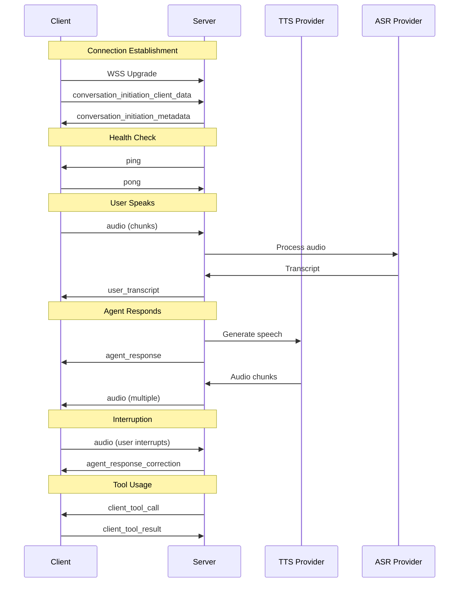

# WebSocket Protocol Reference

## Overview

This document defines the exact WebSocket protocol for Automagik Hello, providing a **drop-in replacement** for ElevenLabs Agents WebSocket API. Every event type, field name, and payload structure must match exactly.

## Connection Details

**Endpoint**: `wss://{server}/v1/convai/conversation`
**Protocol**: WebSocket (RFC 6455)
**Subprotocols**: None required
**Authentication**: Via initial handshake payload or headers

## Message Format

All messages are JSON with a top-level `type` field:
```json
{
  "type": "event_type_name",
  // Event-specific payload
}
```

## Event Flow Diagram



## Server→Client Events

### 1. conversation_initiation_metadata
Sent immediately after client handshake to confirm connection.

```json
{
  "type": "conversation_initiation_metadata",
  "conversation_initiation_metadata_event": {
    "conversation_id": "550e8400-e29b-41d4-a716-446655440000",
    "agent_output_audio_format": "pcm_44100",
    "user_input_audio_format": "pcm_16000"
  }
}
```

### 2. ping
Health check requiring immediate pong response.

```json
{
  "type": "ping",
  "ping_event": {
    "event_id": 1234567890,
    "ping_ms": 50  // Optional RTT estimate
  }
}
```

### 3. audio
TTS audio chunks for playback.

```json
{
  "type": "audio",
  "audio_event": {
    "audio_base_64": "UklGRi4AAABXQVZF...",  // Base64 PCM
    "event_id": 1  // Sequential, starts at 1
  }
}
```

### 4. agent_response
Complete agent text, sent with first audio chunk.

```json
{
  "type": "agent_response",
  "agent_response_event": {
    "agent_response": "Hello! How can I help you today?"
  }
}
```

### 5. agent_response_correction
Truncated response after interruption.

```json
{
  "type": "agent_response_correction",
  "agent_response_correction_event": {
    "original_agent_response": "Let me tell you about the complete history of...",
    "corrected_agent_response": "Let me tell you about..."
  }
}
```

### 6. user_transcript
Finalized ASR result.

```json
{
  "type": "user_transcript",
  "user_transcription_event": {
    "user_transcript": "What's the weather like?"
  }
}
```

### 7. vad_score
Voice activity detection probability.

```json
{
  "type": "vad_score",
  "vad_score_event": {
    "vad_score": 0.95  // 0.0 to 1.0
  }
}
```

### 8. client_tool_call
Request client to execute a function.

```json
{
  "type": "client_tool_call",
  "client_tool_call": {
    "tool_name": "get_weather",
    "tool_call_id": "call_abc123",
    "parameters": {
      "location": "São Paulo",
      "units": "celsius"
    }
  }
}
```

### 9. agent_tool_response
Notification of agent tool execution.

```json
{
  "type": "agent_tool_response",
  "agent_tool_response": {
    "tool_name": "search_knowledge",
    "tool_call_id": "call_def456",
    "tool_type": "system",  // or "custom"
    "is_error": false
  }
}
```

## Client→Server Events

### 1. conversation_initiation_client_data
Initial handshake with configuration.

```json
{
  "type": "conversation_initiation_client_data",
  "conversation_config_override": {
    "agent": {
      "prompt": {
        "prompt": "You are a helpful assistant"
      },
      "first_message": "Hello! How can I help?",
      "language": "pt-BR"
    },
    "tts": {
      "voice_id": "21m00Tcm4TlvDq8ikWAM",
      "model_id": "eleven_flash_v2_5",
      "language": "pt-BR",
      "voice_settings": {
        "stability": 0.5,
        "similarity_boost": 0.75,
        "style": 0.0,
        "use_speaker_boost": false
      }
    },
    "stt": {
      "language": "pt-BR",
      "keywords": ["PagBank", "cartão", "conta"]
    }
  }
}
```

### 2. pong
Health check response.

```json
{
  "type": "pong"
}
```

### 3. audio
User audio chunks.

```json
{
  "type": "audio",
  "audio": "UklGRi4AAABXQVZF..."  // Base64 PCM @ 16kHz
}
```

### 4. contextual_update
Non-interrupting background information.

```json
{
  "type": "contextual_update",
  "text": "User navigated to pricing page"
}
```

### 5. user_message
Text input as if spoken.

```json
{
  "type": "user_message",
  "text": "I want to check my balance"
}
```

### 6. user_activity
Keepalive to prevent timeout.

```json
{
  "type": "user_activity"
}
```

### 7. client_tool_result
Response to tool call request.

```json
{
  "type": "client_tool_result",
  "tool_call_id": "call_abc123",
  "result": {
    "temperature": 25,
    "condition": "sunny"
  },
  "is_error": false
}
```

## Connection Lifecycle

### Establishment
1. Client initiates WSS connection
2. Client sends `conversation_initiation_client_data`
3. Server responds with `conversation_initiation_metadata`
4. Server sends initial `ping` within 1 second
5. Client must respond with `pong`

### Maintenance
- Server sends `ping` every 15-20 seconds
- Client must respond with `pong` within 5 seconds
- Client can send `user_activity` to reset turn timer
- Missing 2 consecutive pongs triggers disconnection

### Termination
- Clean: Client sends close frame (code 1000)
- Timeout: No activity for 20 seconds
- Error: Protocol violation (code 1002)
- Server shutdown: Close with code 1001

## Error Codes

| Code | Meaning | Action |
|------|---------|--------|
| 1000 | Normal closure | Reconnect if needed |
| 1001 | Server going away | Exponential backoff |
| 1002 | Protocol error | Check message format |
| 1003 | Unsupported data | Check event types |
| 1006 | Abnormal closure | Network issue, retry |
| 1008 | Policy violation | Check auth/limits |
| 1011 | Server error | Backoff and retry |

## Audio Specifications

### Input (User → Server)
- **Format**: PCM 16-bit signed little-endian
- **Sample Rate**: 16000 Hz
- **Channels**: 1 (Mono)
- **Frame Size**: 320 bytes (20ms)
- **Encoding**: Base64 in JSON

### Output (Server → User)
- **Format**: PCM 16-bit signed little-endian
- **Sample Rate**: 44100 Hz (or 24000 Hz)
- **Channels**: 1 (Mono)
- **Chunk Size**: ~160ms (configurable)
- **Encoding**: Base64 in JSON

## Implementation Notes

### Event Ordering
- `event_id` in audio events must be sequential
- `agent_response` always precedes its audio chunks
- `user_transcript` follows completed ASR processing
- Tool calls block until `client_tool_result` received

### Timing Constraints
- Pong response: < 5 seconds
- Tool execution: < 5 seconds (configurable)
- First audio chunk: < 900ms after transcript
- Interruption response: < 80ms

### State Tracking
Server must maintain:
- Connection state (handshake/active/closing)
- Current `event_id` counter
- Pending tool calls map
- Audio playback position
- Turn state (listening/thinking/speaking)

Client must maintain:
- Audio buffer by `event_id`
- Tool execution queue
- VAD visualization state
- Conversation history

## Compliance Testing

To verify drop-in compatibility:

1. **Event Names**: All `type` fields must match exactly
2. **Payload Structure**: Nested objects must have same keys
3. **Field Types**: Data types must match (string/number/boolean)
4. **Timing**: Respect timeout and latency requirements
5. **Ordering**: Event sequences must follow documented flow

## References

- ElevenLabs Events: `/docs/agents-platform/customization/events/`
- Audio Formats: `/docs/api-reference/text-to-speech/`
- WebSocket Streaming: `/docs/websockets/`